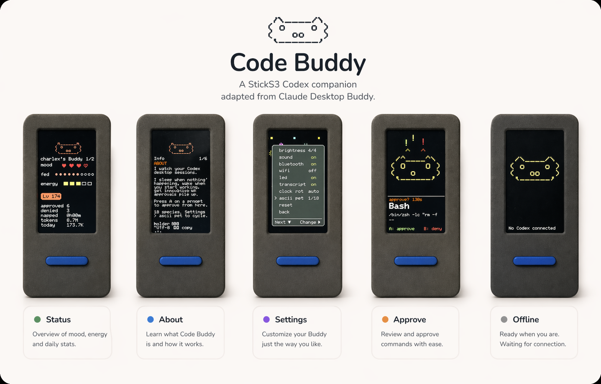

<p align="center">
  <a href="./README.md">
    
  </a>
  <a href="./README.zh-CN.md">
    
  </a>
</p>

<p align="center">
  
</p>

<h1 align="center">Code Buddy</h1>

<p align="center">
  一个基于 StickS3 的 Codex 硬件伙伴，改编自
  <a href="https://github.com/anthropics/claude-desktop-buddy">Claude Desktop Buddy</a>。
</p>

<p align="center">
  给设备刷一次固件，在 macOS 上运行一次 <code>code-buddy</code>，之后照常使用 <code>codex</code>，审批提示和会话状态就会转移到独立硬件上。
</p>

> 如果你想自己做硬件客户端，可以看 [firmware/REFERENCE.md](firmware/REFERENCE.md) 里的 BLE 协议和 JSON 负载定义。

## 项目包含什么

- 一个 macOS 主机桥接层，负责与 StickS3 配对、同步时间、安装原生 BLE helper，并管理本地 `codex` shim。
- 一套 StickS3 固件，包含状态页、审批页、设置页和离线页。
- 一套尽量不打扰日常工作的流程：先跑一次 `code-buddy`，之后直接用 `codex`。

## 快速开始

### 1. 给 StickS3 刷机

从 GitHub Releases 下载 `code-buddy-sticks3-v{version}-full.bin`，然后写入到 `0x0`。

优先方式：

- 如果当前 release 提供 web flasher，直接用它把合并镜像写到 `0x0`。

兜底方式：

```bash
esptool --chip esp32s3 --port /dev/cu.usbmodem101 --baud 460800 write_flash 0x0 code-buddy-sticks3-v0.1.2-full.bin
```

开发者本地生成 release 镜像：

```bash
./scripts/build-firmware-release.sh
```

### 2. 在 macOS 上安装

```bash
brew install CharlexH/tap/code-buddy
code-buddy
```

首次运行时，Code Buddy 会：

- 安装原生蓝牙 helper
- 与 `Codex-*` 设备配对
- 同步设备时间
- 安装 launchd agent
- 安装本地 `codex` shim
- 把 `~/.code-buddy/bin` 加进 `~/.zprofile`

### 3. 正常使用

```bash
codex
```

初始化完成后请开一个新 shell。此后你可以保持原来的 CLI 使用方式，Code Buddy 会在后台维持桥接，并把审批提示显示到 StickS3 上。

## 按键说明

|                         | 常规界面             | 宠物界面    | 信息界面    | 审批界面    |
| ----------------------- | -------------------- | ----------- | ----------- | ----------- |
| **A**（正面）           | 下一个页面           | 下一个页面  | 下一个页面  | **批准**    |
| **B**（右侧）           | 滚动 transcript      | 下一页      | 下一页      | **拒绝**    |
| **长按 A**              | 菜单                 | 菜单        | 菜单        | 菜单        |
| **Power**（左侧，短按） | 熄屏 / 亮屏          |             |             |             |
| **Power**（左侧，约 6s）| 强制关机             |             |             |             |
| **摇一摇**              | dizzy                |             |             | —           |
| **正面朝下**            | nap（恢复能量）      |             |             |             |

屏幕在 30 秒无操作后会自动熄灭；如果有待处理审批，会保持常亮。按任意键都可以唤醒。

## Buddy 状态

| 状态        | 触发条件                  | 表现                        |
| ----------- | ------------------------- | --------------------------- |
| `sleep`     | bridge 未连接             | 闭眼，慢呼吸                |
| `idle`      | 已连接，但没有紧急事件    | 眨眼，左右看                |
| `busy`      | 会话正在活跃运行          | 出汗，忙碌                  |
| `attention` | 有待审批请求              | 警觉，**LED 闪烁**          |
| `celebrate` | 升级（每 50K tokens）     | 撒花，跳动                  |
| `dizzy`     | 你摇了设备                | 蚊香眼，摇晃                |
| `heart`     | 在 5 秒内完成批准         | 飘心                        |

<details>
<summary><strong>角色和自定义素材包</strong></summary>

固件内置了十八个 ASCII 宠物，每个宠物都包含七种动画：`sleep`、`idle`、`busy`、`attention`、`celebrate`、`dizzy` 和 `heart`。

在设备上进入 `menu -> next pet` 可以轮换角色。选择会保存在设备存储里，重启后仍会保留。

如果你想换成自定义 GIF 角色，可以准备一个包含 `manifest.json` 和对应七种状态 GIF 的角色包。GIF 建议宽度为 96px：

```json
{
  "name": "bufo",
  "colors": {
    "body": "#6B8E23",
    "bg": "#000000",
    "text": "#FFFFFF",
    "textDim": "#808080",
    "ink": "#000000"
  },
  "states": {
    "sleep": "sleep.gif",
    "idle": ["idle_0.gif", "idle_1.gif", "idle_2.gif"],
    "busy": "busy.gif",
    "attention": "attention.gif",
    "celebrate": "celebrate.gif",
    "dizzy": "dizzy.gif",
    "heart": "heart.gif"
  }
}
```

说明：

- `idle` 可以是一张 GIF，也可以是一组 GIF 数组。
- 高度控制在约 140px 以内会比较适合 StickS3 屏幕。
- 可以参考 [firmware/characters/bufo/](firmware/characters/bufo/) 的现成示例。
- 资源处理和刷写工具在 [firmware/tools/prep_character.py](firmware/tools/prep_character.py) 和 [firmware/tools/flash_character.py](firmware/tools/flash_character.py)。
</details>

## 恢复命令

```bash
code-buddy doctor
code-buddy repair
code-buddy uninstall
```

`doctor` 会告诉你哪里出了问题、为什么会这样，以及下一步应该怎么做。

<details>
<summary><strong>从源码运行</strong></summary>

```bash
python3 -m venv .venv
.venv/bin/pip install -e '.[dev]'
.venv/bin/code-buddy
```

验证命令：

- 主机侧测试：`.venv/bin/pytest -q`
- 固件构建：`cd firmware && pio run`
</details>
